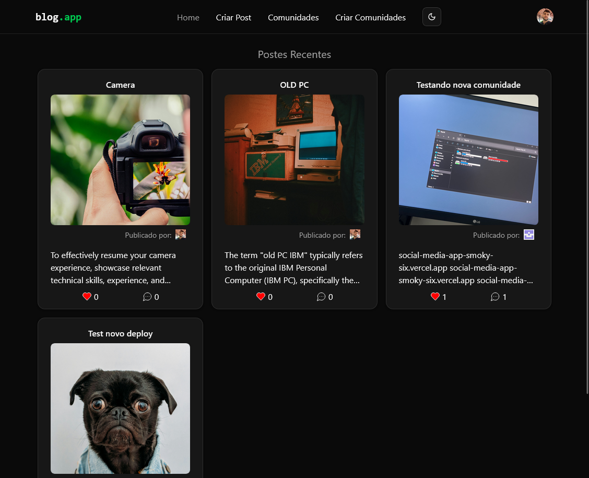

# Blog.app

Blog.app é uma aplicação de rede social desenvolvida com React, TypeScript e Vite, que permite aos usuários criar posts, comentar, curtir/descurtir e interagir em comunidades. O projeto utiliza Supabase como backend para autenticação, banco de dados e armazenamento de imagens.

## Funcionalidades

- Autenticação via GitHub (OAuth)
- Criação, listagem e visualização de posts com upload de imagens
- Curtidas e descurtidas em posts
- Sistema de comentários e respostas em árvore (threaded)
- Criação e listagem de comunidades
- Filtro de posts por comunidade
- Alternância de tema (claro/escuro/sistema)
- Interface responsiva e moderna com Tailwind CSS

## Tecnologias Utilizadas

- [React](https://react.dev/)
- [TypeScript](https://www.typescriptlang.org/)
- [Vite](https://vitejs.dev/)
- [Supabase](https://supabase.com/)
- [React Router](https://reactrouter.com/)
- [@tanstack/react-query](https://tanstack.com/query/latest)
- [Tailwind CSS](https://tailwindcss.com/)
- [Radix UI](https://www.radix-ui.com/)
- [Lucide Icons](https://lucide.dev/)

## Como rodar o projeto

1. **Clone o repositório:**

   ```sh
   git clone https://github.com/seu-usuario/blog-app.git
   cd blog-app

   ```

2. **Instale as dependências:**

   ```sh
   npm install

   ```

3. **Configure as variáveis de ambiente:**
   Crie um arquivo .env na raiz do projeto com as seguintes variáveis:

   ```sh
    VITE_SUPABASE_URL=SuaURLDoSupabase
    VITE_SUPABASE_ANON_KEY=SuaAnonKeyDoSupabase

   ```

4. **Inicie o servidor de desenvolvimento:**

   ```sh
   npm run dev

   ```

5. **Acesse no navegador:**

   Abra http://localhost:5173

## 📊 Pagina Inicial


